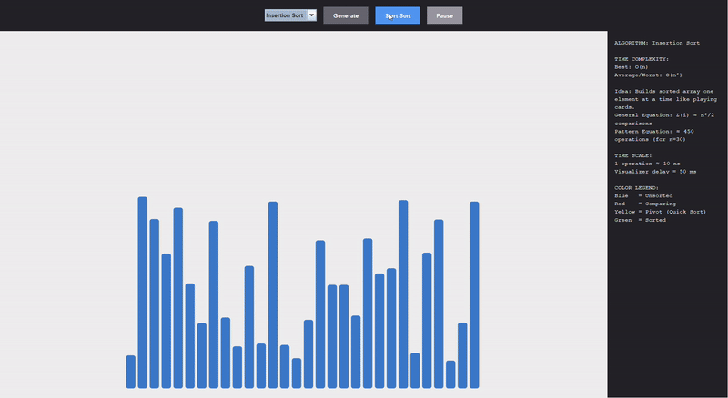

#  Sorting Visualizer

This project is an interactive sorting algorithm visualizer built in Java Swing.  
It demonstrates the internal mechanics of classic sorting techniques through real-time animation, step-by-step debugging, and mathematical analysis. The tool is designed as a learning aid for Data Structures and Algorithms, allowing users to pause execution, rewind states, and observe how data moves during sorting in real time.

## How is it built?


##  Key Features

- **Snapshot Debugger**  
  Records every array state. Pause the sort and scrub through history using **← Previous** and **Next →**.

- **Fluid Animation Engine**  
  High-performance `Graphics2D` rendering with anti-aliasing and rounded bar geometry.

- **Live Operation Tracking**  
  Real-time comparison + move counters.

- **Theory Panel**  
  Displays time complexity, recurrence equations, evaluated formulas based on array size, and color legend.

- **Deep Time Analysis**  
  Estimates actual CPU execution time vs. visualized delay scale.

- **Thread-safe Control System**  
  Monitor-based pause/resume/step execution.

##  Supported Algorithms

| Algorithm | Best Case | Average Case | Worst Case |
| :--- | :--- | :--- | :--- |
| Bubble Sort | O(n) | O(n²) | O(n²) |
| Selection Sort | O(n²) | O(n²) | O(n²) |
| Insertion Sort | O(n) | O(n²) | O(n²) |
| Merge Sort | O(n log n) | O(n log n) | O(n log n) |
| Quick Sort | O(n log n) | O(n log n) | O(n²) |
| Heap Sort | O(n log n) | O(n log n) | O(n log n) |
| Shell Sort | depends on gap | ~O(n^(3/2)) | O(n²) |

##  How to Use

1. Select an algorithm
2. Generate a dataset
3. Start the sort
4. Pause anytime to step backward/forward
5. Resume from any snapshot

##  Installation

```bash
javac DSAVisualizer.java
java DSAVisualizer
```

Requires Java 11+

## Output



[Watch the full 1-min demo here](media/output.mp4)


